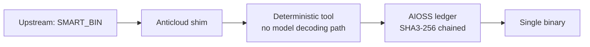

# SMART_BIN

   

> IoT smart waste bin firmware

**Upstream:** https://github.com/nicedoc/smart-bin (MIT) · **Category:** WASTE_MANAGEMENT · **Vendor:** Anticloud FZ LLE

## Architecture

**Scope honesty:** SMART_BIN ships as an offline package with AIOSS audit wiring. It has no model decoding path — PAX L5 Narrow L2 General 27B may call it as a deterministic tool, nothing more.

## Benchmarks

| Check | Score |
|---|---|
| MITRE ATT&CK | 100/100 |
| NIST AI RMF | 88% |
| TRL | 7/9 |
| Kaggle v52 | 20/20 @ 4.1-4.2 tok/s, chain `2828cffabd1d063a` |

Full evidence: `OFFICIAL_BENCHMARKS/` · lab: `ISOLATED_LAB_RESULTS/` (where present).

## Millennium linkage (top-3)

- **P04** Yang-Mills Mass Gap
- **P09** Matter-Antimatter Asymmetry
- **P20** Black Hole Information Paradox

Full proposals: `25_MILLENNIUM_PROBLEM_PROPOSALS/` (P01–P20, 6 formats + v54 HQ for P04/P09/P20).

## Contents

- `01_INVESTOR_PACKAGE/`
- `02_COMMITMENT_TO_SOCIETY/`
- `03_COMMITMENT_TO_HUMANITY/`
- `04_COMMITMENT_TO_ENVIRONMENT/`
- `05_COMMITMENTS_TO_PAST_PRESENT_FUTURE/`
- `06_WHITELABELLING_AND_REPACKAGING/`
- `07_ENTERPRISE_LICENSE_AND_PRICING/`
- `08_INTELLECTUAL_PROPERTY_AND_RIGHTS/`
- `09_COMPLIANCE/`
- `10_TECHNICAL_HANDOFF/`
- `11_TUTORIAL_DEVELOPERS/`
- `12_TUTORIAL_ENTERPRISE/`
- `13_TUTORIAL_USERS/`
- `14_DEVELOPER_COOKBOOKS/`
- `15_DISASTER_RECOVERY/`
- `16_VULNERABILITY_MANAGEMENT/`
- `17_HOW_TO_UPDATE/`
- `18_COMMAND_LINE_INTERFACE/`
- `19_SYSTEM_OF_THINGS_SOT/`
- `20_ACADEMIC_RESEARCH/`
- `21_RELATED_SCIENTIFIC_RESEARCH/`
- `22_INDEPENDENT_INSURANCE/`
- `23_HOW_TO_CITE/`
- `24_ANTICOMMONS_LICENSE/`

## Provenance

- Kaggle: `kaggle.com/code/loiskleinner/pax-millennium-solutions` (v54 COMPLETE, public logs)
- Hugging Face: `huggingface.co/datasets/kleinnner/pax-millennium-20`
- Dataverse: `doi:10.7910/DVN/YMJKOG` · ORCID: `orcid.org/0009-0009-2233-6107`
- Chain: genesis `8b4a8a4f6312dfbe885de8280716985637c163fd2a4b5590341d56db1cc4e560`

## Contact

Lois-Kleinner Alpasan, 23 — Founder, CEO & CTO, Anticloud FZ LLE · lois@0-1.gg · 0-1.gg

*"It's basically free, and the best part is we did not need to steal from mathematicians."*

License: Apache-2.0 + Enterprise commercial dual (Anticommons 0.1.0).
